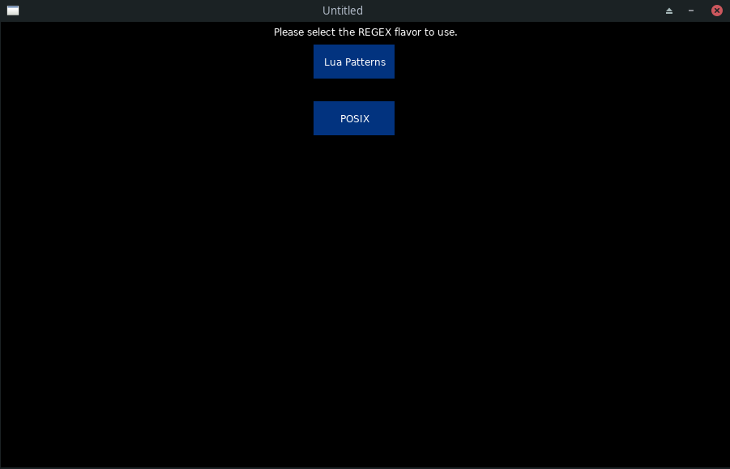

# RegexAttack
A simple game for practicing regular expressions. Written using Lua and Love2d.

## Instructions  
At the start of the game you select your regex flavor, either Lua patterns or POSIX, then select difficulty.  
During gameplay each ship has a prompt with a description of a pattern to match. Player must write a Regular Expression to match it.  
If the pattern matches what the prompt describes then the ship is destroyed. 
If an enemy ship reaches the red line at the left hand side then the player loses health.  
Game includes three rounds, with each round including a number of enemy ships based on selected difficulty.

## Installing

Requires:
- Lua >=5.1  
- Love2D
- GCC
- make

To install Regex C library simply run `make` in the root directory.  
To run, use `love RegexAttack` one level above root directory.

## includes:  
- [tick module](https://github.com/rxi/tick)  
- [Lume module](https://github.com/rxi/lume)   
- [Graphic assets from Kenney](https://kenney.nl/)  

## screenshots  
  
  
